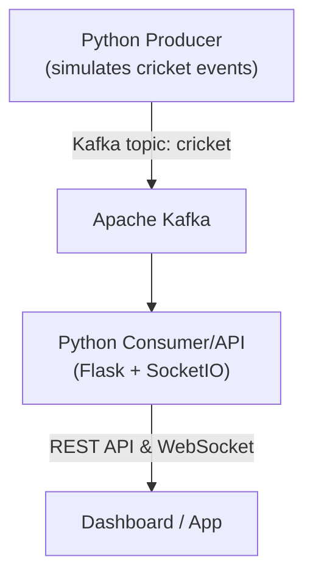

# Real-Time Cricket Match Data Pipeline

## Overview

This project simulates real-time cricket match data and streams it using Apache Kafka. A Python producer reads historical cricket match and commentary data, simulates live events, and publishes them to a Kafka topic. A Python consumer listens to this topic, maintains the latest state for each match, and exposes live scores and match data via a REST API and WebSocket for real-time dashboards or applications.

---

## Tech Stack

- **Apache Kafka**: Message broker for real-time event streaming
- **Python Producer**: Simulates and streams cricket match events to Kafka
- **Python Consumer/API**: Consumes events, maintains match state, and serves data via REST and WebSocket (Flask + Flask-SocketIO)
- **Docker & Docker Compose**: Containerized deployment for all services

---

## Project Structure

```
real-time-data-pipeline/
├── docker-compose.yaml         # Docker Compose setup for Kafka, Zookeeper, Producer, Consumer/API
├── producer/
│   ├── producer.py             # Cricket match event producer
│   ├── consumer.py             # Kafka consumer + REST/WebSocket API
│   ├── requirements.txt        # Python dependencies
│   ├── Dockerfile              # Producer/Consumer Dockerfile
│   └── <match folders>/        # Folders with match.json and commentary data
```

---

## Setup & Running

### 1. Prerequisites
- Docker and Docker Compose installed
- Recommended: 4GB+ RAM

### 2. Start All Services

```sh
docker-compose up --build
```

- This will start Kafka, Zookeeper, the cricket data producer, and the consumer/API service.

### 3. Access the API

- The REST API will be available at: [http://localhost:5000](http://localhost:5000)
- WebSocket clients can connect to the same port for real-time updates.

---

## API Endpoints

### 1. **Health Check**
- **GET** `/health`
- Returns service status and stats.

### 2. **Live Scores**
- **GET** `/live-scores`
- **Query:** `?match_id=<id>` (optional)
- Returns the latest event for each match, or for a specific match if `match_id` is provided.

### 3. **Match History**
- **GET** `/match-history`
- **Query:** `?match_id=<id>` (optional)
- Returns all events for a match, or all matches if no `match_id`.

### 4. **Live Matches**
- **GET** `/live-matches`
- Returns a summary of all live matches (teams, scores, players, etc.).

### 5. **Teams**
- **GET** `/teams`
- **Query:** `?team_id=<id>` (optional)
- Returns all teams or a specific team by ID.

### 6. **Players**
- **GET** `/players?team_id=<id>`
- Returns all players for a given team.

#### Example Response for `/live-scores`
```json
{
  "match_id": "bcck05032025257266",
  "series": "IPL 2025",
  "venue": "Wankhede Stadium",
  "teams": ["Mumbai Indians", "Chennai Super Kings"],
  "score": "120/3",
  "toss_winner": "Mumbai Indians",
  "toss_decision": "bat",
  "current_over": 12.3,
  "striker": {"name": "Rohit Sharma", "runs": 45},
  "non_striker": {"name": "Ishan Kishan", "runs": 30, "balls": 20, "fours": 4, "sixes": 1},
  "bowler": {"name": "Deepak Chahar", "stats": {"balls": 18, "runs": 25, "wickets": 1}},
  "timestamp": "2025-05-03T19:45:00Z",
  "commentary": "Rohit flicks it for a single."
}
```

---

## Architecture Diagram



---

